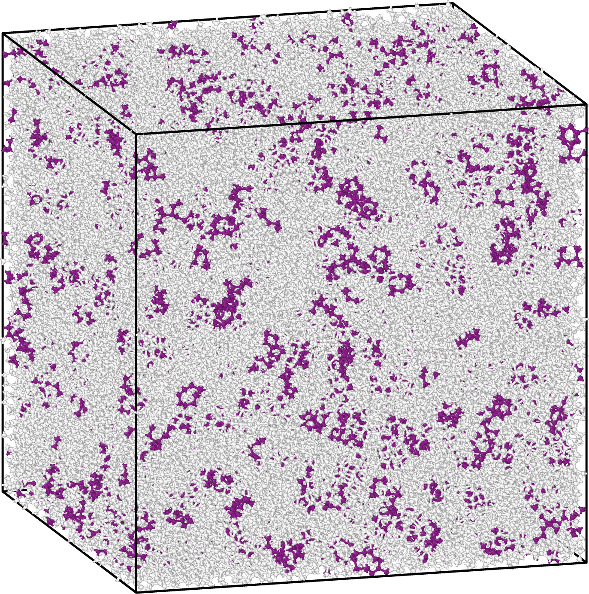

Julia Rings
===========

This package provides a tool for finding primitive rings efficiently for large models of amorphous materials.

Designed for large structural models, this can handle 100,000-atoms in under 10 minutes multithreaded on a 16GB M2 Mac laptop.

This package implements an algorithm based on the work described in:

| Yuan, X. & Cormack, A. N. 
| `"Efficient Algorithm for Primitive Ring Statistics in Topological Networks." <https://doi.org/10.1016/S0927-0256(01)00256-7>`_.
| Computational Materials Science, vol. **24**, pp. 343-360, 2002.  
|  

   100k model of a-Si with the 9-membered primitive rings highlighted

Features
--------

- Python wrappers for easy plotting and incorporation into more complex analysis frameworks.
- Provides the node indices for each ring in your structure

Dependencies
------------

Before using this package, ensure you have the required Julia packages installed. Python dependencies are handled by pip.    

To install Julia, use your package manager (brew, apt etc.) or visit the downloads page: https://julialang.org/downloads/  

**Open the Julia REPL:**

.. code-block:: bash

   julia

**Install the packages:**

.. code-block:: julia

   using Pkg
   Pkg.add("PyCall")
   Pkg.add("JSON")
   Pkg.add("Formatting")

Installation
------------

1. Clone the repository:

   .. code-block:: bash

      git clone --recursive git@github.com:MorrowChem/julia_rings.git
      cd julia_rings

2. Install the package using pip:

   .. code-block:: bash

      pip install ./

Usage
-----

Run the provided Python script to analyze rings in molecular structures:

.. code-block:: bash

   export JULIA_NUM_THREADS=2 && python run_rings.py structures/aSi_500atom_test.xyz

Supported Platforms
-------------------

This package has been tested on macOS and Linux.

Contributing
------------

Contributions are welcome! Feel free to open issues or pull requests on the GitHub repository:

https://github.com/MorrowChem/julia_rings

License
-------

This project is licensed under the MIT License - see the LICENSE file for details.
